# 👋 Hi there, I'm **Suhani Jain**

<div align="center">
  
  
  
  
  
</div>

---

## 🚀 **About Me**

```javascript
const suhani = {
    currentStatus: "Third Year Computer Engineering Student",
    location: "India 🇮🇳",
    expertise: ["Git", "GitHub", "GitOps"],
    currentlyLearning: ["Advanced Algorithms", "System Design", "DevOps"],
    askMeAbout: ["Web Development", "Version Control", "Software Engineering"],
    funFact: "I debug with console.log() and I'm not ashamed! 😄",
    contact: "suhanijain8125@gmail.com"
};
```

---

## 🛠️ **Tech Arsenal**

<div align="center">

### **Languages**


### **Frontend**


### **Backend & Databases**


### **Tools & Technologies**


</div>

---

## 📊 **GitHub Analytics**

<div align="center">
  
  
  
  
</div>

<div align="center">
  
  
  
</div>

---

## 🏆 **Achievements**

<div align="center">
  
  
  
</div>

---

## 📈 **Contribution Graph**

<div align="center">
  
  
  
</div>

---

## 💡 **Current Focus**

```mermaid
graph TD
    A[🎯 Learning Goals] --> B[System Design]
    A --> C[Advanced Algorithms]
    A --> D[DevOps & CI/CD]
    A --> E[Cloud Technologies]
    
    B --> F[Scalable Architecture]
    C --> G[Data Structures Mastery]
    D --> H[Docker & Kubernetes]
    E --> I[AWS/Azure Certification]
    
    style A fill:#00d9ff,stroke:#fff,stroke-width:2px,color:#000
    style B fill:#1a1a1a,stroke:#00d9ff,stroke-width:2px,color:#fff
    style C fill:#1a1a1a,stroke:#00d9ff,stroke-width:2px,color:#fff
    style D fill:#1a1a1a,stroke:#00d9ff,stroke-width:2px,color:#fff
    style E fill:#1a1a1a,stroke:#00d9ff,stroke-width:2px,color:#fff
```

<div align="center">



</div>

---

## 🌐 **Connect With Me**

<div align="center">
  
  [](https://linkedin.com/in/suhani-jain)
  [](mailto:suhanijain8125@gmail.com)
  [](https://github.com/suhanijain8125)
  
</div>

---

## 💭 **Random Dev Quote**

<div align="center">
  
  
  
</div>

---

## 🐍 **Watch My Contributions Get Eaten**

<div align="center">
  
  
  
</div>

---

<div align="center">
  
  **"Code is like humor. When you have to explain it, it's bad."** – Cory House
  
  
  
  
  
</div>
